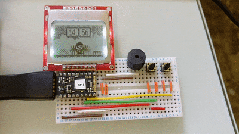
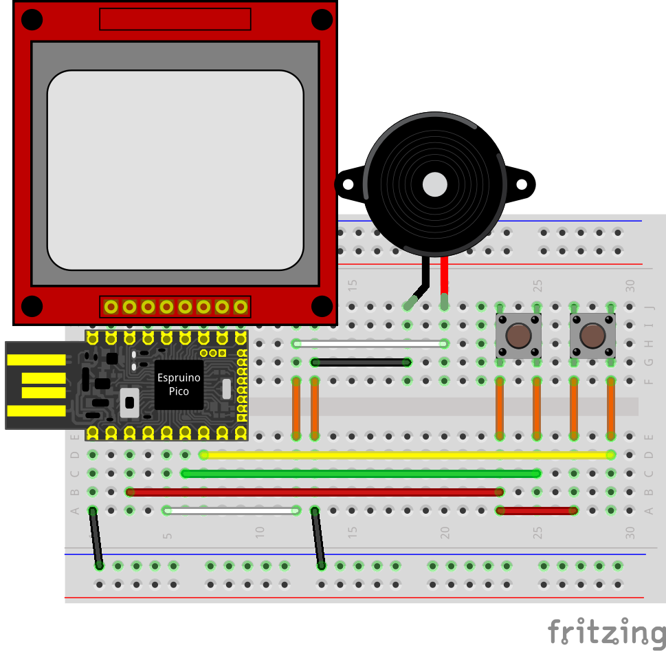
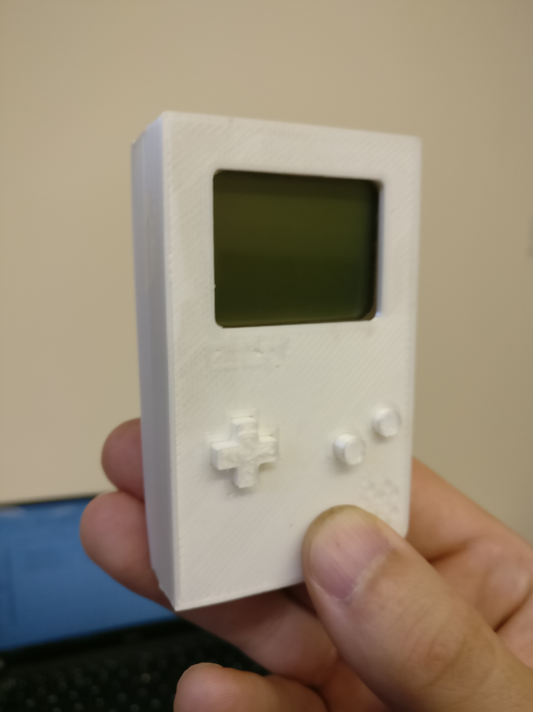

# Espruino Pico Mario Clock
A simple project using the Espruino Pico to make a cool Mario clock

  

Every minute Mario will jump and hit the blocks to change the time. The speaker will make a coin noise when this happens, unless it is at the top or bottom of the hour, where it will play a part of the Mario tune.

It has two buttons, the first turns the display back light on and off, while the second turns the sound on and off

_Note_: This project is in a prototype state. The projects goal is to have the electronics permanently housed in a mini Gameboy like case. The STL plans for the case will be included with this repo when completed so you can print your own!

## Hardware
1. [Espruino Pico](https://shop.pimoroni.com/products/espruino-pico)
2. [Nokia display](https://shop.pimoroni.com/products/graphic-lcd-84x48-nokia-5110)
3. [Speaker](https://shop.pimoroni.com/products/mini-speaker-pc-mount-12mm-2-048khz)
4. [Buttons](https://www.amazon.co.uk/gp/product/B01N67ICEC/ref=oh_aui_detailpage_o00_s00?ie=UTF8&psc=1)
5. [Breadboard](https://shop.pimoroni.com/products/colourful-mini-breadboard?variant=264820344)
6. [Wire](https://www.amazon.co.uk/Solderless-Flexible-Breadboard-Jumper-Arduino/dp/B00GX6V48C/ref=sr_1_19?ie=UTF8&qid=1532784726&sr=8-19&keywords=wires)

## Pico diagram
Before you start putting the parts together, you may wish to review the Pico layout diagram:

  

## Setup
The complete wiring diagram for the project:

  

1. *Soldering*:
You must solder the pins into the pico and into the display first, so that they can be inserted in to the breadboard.
2. *Placement*:
Follow the wiring diagram, being very careful to check the wires are connected to the right pins in the Pico, and that the display is aligned to the right most pin in the Pico (A5)

## Installing the code
You will need to install the code via the IDE, the instructions may be found [here](https://www.espruino.com/Web+IDE)
Once you have the IDE setup and also running, and the pico and its components wired up, we can now plug the Pico in to the computers USB port (any USB port).

Clone or download a zip this repo to your computer somewhere, if you download this project as a zip file you must also unzip it first.

In the IDE you can open the file `mario_clock.js`, and now we connect the IDE to your Pico by clicking the connect button.

Once the Pico is connected, you click the `Send to Espruion` button, it will take a few seconds to send over all the code. Once its completed the transfer, in interactive REPL window you write `save()`. This will install the code on to the Pico and start it.

While prototyping instead of executing the command `save()` to commit the work to the Pico, you can execute `onInit()`, which will call the main function of the program, thus starting it on the Pico.

## Notes

### Power
When the Pico looses power (by unplugging it from the USB port) it will forget the time as it has no other power supply to maintain the time. A battery may help solve this.

### Time keeping
The Pico is not great at keeping the time, and over the days and months the time will drift from the true time. To keep the time correct, an option would be to connect a WiFi module to it, which can get the time from a time server on the internet and keep the time in sync.

### Graphics
The graphics were created in [Gimp](https://www.gimp.org/). You must create 1 bit BMP images before we can convert them using this [online tool](https://www.espruino.com/Image+Converter).

To set an image to 1 bit in Gimp you must set the following image attributes:

1. Click `Image`	
2. Click `Mode`
3. Click `Indexed`
4. In the popup window click `Use black and white (1-bit) palette`
5. Now _`EXPORT`_ your image as a `BMP`

The [online tool](https://www.espruino.com/Image+Converter) will then allow you to upload your 1-bit BMP and generate a JS snippet with the image converted for you.

## Wrapping it all up

  

If you want to take the project full geek, you can print out a Gameboy-esq case for this Mario clock project. To fit all the electronics in you may have to design a custom circuit board and get a bit creative about it, but its a nice touch!

In the resources folder of this project are the STL files I have designed (using [TinkerCAD](https://tinkercad.com)). You can use and modify these files to suit your project.

I used a [CELRobox](https://cel-robox) to print mine, but these STL files should be printable on any 3D printer you may have or have access to.

